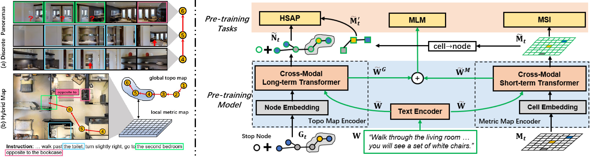

<div align="center">

<h1>BEVBert: Multimodal Map Pre-training for <br /> Language-guided Navigation</h1>

<div>
    <a href='https://marsaki.github.io/' target='_blank'>Dong An</a>;
    <a href='https://sites.google.com/site/yuankiqi/home' target='_blank'>Yuankai Qi</a>;
    <a href='https://scholar.google.com/citations?user=a7AMvgkAAAAJ&hl=zh-CN'>Yangguang Li</a>;
    <a href='https://yanrockhuang.github.io/' target='_blank'>Yan Huang</a>;
    <a href='http://scholar.google.com/citations?user=8kzzUboAAAAJ&hl=zh-CN' target='_blank'>Liang Wang</a>;
    <a href='https://scholar.google.com/citations?user=W-FGd_UAAAAJ&hl=en' target='_blank'>Tieniu Tan</a>;
    <a href='https://amandajshao.github.io/' target='_blank'>Jing Shao</a>;
</div>

<h3><strong>Accepted to <a href='https://iccv2023.thecvf.com/' target='_blank'>ICCV 2023</a></strong></h3>

<h3 align="center">
  <a href="https://arxiv.org/pdf/2212.04385.pdf" target='_blank'>Paper</a>
</h3>
</div>

## Abstract

Large-scale pre-training has shown promising results on the vision-and-language navigation (VLN) task. However, most existing pre-training methods employ discrete panoramas to learn visual-textual associations. This requires the model to implicitly correlate incomplete, duplicate observations within the panoramas, which may impair an agent’s spatial understanding. Thus, we propose a new map-based pre-training paradigm that is spatial-aware for use in VLN. Concretely, we build a local metric map to explicitly aggregate incomplete observations and remove duplicates, while modeling navigation dependency in a global topological map. This hybrid design can balance the demand of VLN for both short-term reasoning and long-term planning. Then, based on the hybrid map, we devise a pre-training framework to learn a multimodal map representation, which enhances spatial-aware cross-modal reasoning thereby facilitating the language-guided navigation goal. Extensive experiments demonstrate the effectiveness of the map-based pre-training route for VLN, and the proposed method achieves state-ofthe-art on four VLN benchmarks (R2R, R2R-CE, RxR, REVERIE).

## Method



## TODOs

* [X] Release VLN (R2R, RxR, REVERIE) code.
* [X] Release VLN-CE (R2R-CE) code.
* [X] Data preprocessing code.
* [X] Release checkpoints and preprocessed datasets.

## Setup

### Installation

1. Create a virtual environment. We develop this project with Python 3.6.

   ```bash
   conda env create -f environment.yaml
   ```
2. Install the latest version of [Matterport3DSimulator](https://github.com/peteanderson80/Matterport3DSimulator), including the Matterport3D RGBD datasets (for step 6).
3. Download the Matterport3D scene meshes. `download_mp.py` must be obtained from the Matterport3D [project webpage](https://niessner.github.io/Matterport/). `download_mp.py` is also used for downloading RGBD datasets in step 2.

```bash
# run with python 2.7
python download_mp.py --task habitat -o data/scene_datasets/mp3d/
# Extract to: ./data/scene_datasets/mp3d/{scene}/{scene}.glb
```

Follow the [Habitat Installation Guide](https://github.com/facebookresearch/habitat-lab#installation) to install [`habitat-sim`](https://github.com/facebookresearch/habitat-sim) and [`habitat-lab`](https://github.com/facebookresearch/habitat-lab). We use version [`v0.1.7`](https://github.com/facebookresearch/habitat-lab/releases/tag/v0.1.7) in our experiments. In brief:

4. Install `habitat-sim` for a machine with multiple GPUs or without an attached display (i.e. a cluster):

   ```bash
   conda install -c aihabitat -c conda-forge habitat-sim=0.1.7 headless
   ```
5. Clone `habitat-lab` from the github repository and install. The command below will install the core of Habitat Lab as well as the habitat_baselines.

   ```bash
   git clone --branch v0.1.7 git@github.com:facebookresearch/habitat-lab.git
   cd habitat-lab
   python setup.py develop --all # install habitat and habitat_baselines
   ```
6. Grid feature preprocessing for metric mapping (~100G).

   ```bash
   # for R2R, RxR, REVERIE
   python precompute_features/grid_mp3d_clip.py
   python precompute_features/grid_mp3d_imagenet.py
   python precompute_features/grid_depth.py
   python precompute_features/grid_sem.py

   # for R2R-CE pre-training
   python precompute_features/grid_habitat_clip.py
   python precompute_features/save_habitat_img.py --img_type depth
   python precompute_features/save_depth_feature.py
   ```
7. Download preprocessed instruction datasets and trained weights [[link]](https://drive.google.com/file/d/1jYg_dMlCDZoOtrkmmq40k-_-m6xerdUI/view?usp=sharing). The directory structure has been organized. For R2R-CE experiments, follow [ETPNav](https://github.com/MarSaKi/ETPNav) to configure VLN-CE datasets in `bevbert_ce/data` foler, and put the trained CE weights [[link]](https://drive.google.com/file/d/1-2u1NWmwpX09Rg7uT5mABo-CBTsLthGm/view?usp=sharing) in `bevbert_ce/ckpt`.

Good luck on your VLN journey with BEVBert!

## Running

Pre-training. Download precomputed image features [[link]](https://drive.google.com/file/d/1S8jD1Mln0mbTsB5I_i2jdQ8xBbnw-Dyr/view?usp=sharing) into folder `img_features`.

```
CUDA_VISIBLE_DEVICES=0,1,2,3 bash scripts/pt_r2r.bash 2333  # R2R
CUDA_VISIBLE_DEVICES=0,1,2,3 bash scripts/pt_rxr.bash 2333  # RxR
CUDA_VISIBLE_DEVICES=0,1,2,3 bash scripts/pt_rvr.bash 2333  # REVERIE

cd bevbert_ce/pretrain 
CUDA_VISIBLE_DEVICES=0,1,2,3 bash run_pt/run_r2r.bash 2333  # R2R-CE
```

Fine-tuning and Testing, the trained weights can be found in step 7.

```
CUDA_VISIBLE_DEVICES=0,1,2,3 bash scripts/ft_r2r.bash 2333  # R2R
CUDA_VISIBLE_DEVICES=0,1,2,3 bash scripts/ft_rxr.bash 2333  # RxR
CUDA_VISIBLE_DEVICES=0,1,2,3 bash scripts/ft_rvr.bash 2333  # REVERIE

cd bevbert_ce
CUDA_VISIBLE_DEVICES=0,1,2,3 bash run_r2r/main.bash [train/eval/infer] 2333  # R2R-CE
```

# Contact Information

* dong DOT an AT cripac DOT ia DOT ac DOT cn, [Dong An](https://marsaki.github.io/)
* yhuang AT nlpr DOT ia DOT ac DOT cn, [Yan Huang](https://yanrockhuang.github.io/)

# Acknowledge

Our implementations are partially inspired by [DUET](https://github.com/cshizhe/VLN-DUET), [S-MapNet](https://github.com/vincentcartillier/Semantic-MapNet) and [ETPNav](https://github.com/MarSaKi/ETPNav).

Thank them for open sourcing their great works!

# Citation

If you find this repository is useful, please consider citing our paper:

```
@article{an2023bevbert,
  title={BEVBert: Multimodal Map Pre-training for Language-guided Navigation},
  author={An, Dong and Qi, Yuankai and Li, Yangguang and Huang, Yan and Wang, Liang and Tan, Tieniu and Shao, Jing},
  journal={Proceedings of the IEEE/CVF International Conference on Computer Vision},
  year={2023}
}
```
